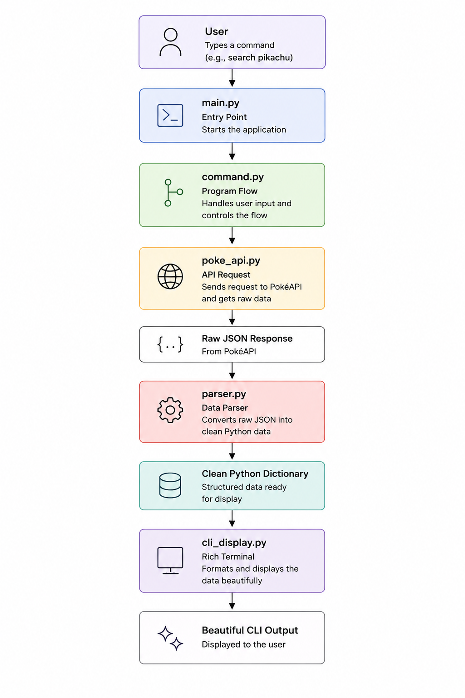

# Pocket-Dex Data Flow

This document explains how data moves through Pocket-Dex, from the moment a user enters a command until the result is displayed in the terminal.

---

# Architecture Overview
<p align="center">
  
</p>


---

# Step 1 — `main.py`

**Responsibility:** Application entry point.

The application starts here by creating and running the Textual application.

This file contains no application logic.

---

# Step 2 — `cli_display.py`

**Responsibility:** User interface and application controller.

This module creates the Textual interface and manages the application's event loop.

Responsibilities include:

- Creating the application layout.
- Receiving user input.
- Handling built-in commands (`/help`, `/info`, `/clear`, `/exit`).
- Calling the command handler.
- Updating the interface with the returned Rich renderables.
- Displaying search history and API status.

---

# Step 3 — `command.py`

**Responsibility:** Command processing.

This module receives the parsed command and determines which backend functionality should execute.

Supported commands include:

- `/search`
- `/random`
- `/type`
- `/compare`

For each command it coordinates the backend by:

- Retrieving data.
- Updating search history when appropriate.
- Formatting the final output.

The module returns Rich renderables to the UI rather than raw data.

---

# Step 4 — `poke_api.py`

**Responsibility:** API communication.

This module is the only component that communicates with the PokéAPI.

It retrieves:

- Pokémon information
- Pokémon species information
- Pokémon by type
- API availability

The returned data is raw JSON.

---

# Step 5 — `parser.py`

**Responsibility:** Data extraction.

The parser converts raw API responses into a clean Python dictionary.

It extracts only the fields required by Pocket-Dex, including:

- Name
- Pokédex ID
- Types
- Abilities
- Base Stats
- Height
- Weight
- Description
- Status
- Moves

No user interface code exists in this module.

---

# Step 6 — `history_handler.py`

**Responsibility:** Search history management.

This module maintains the user's search history.

Responsibilities include:

- Loading previous searches.
- Adding new searches.
- Removing old entries.
- Saving the updated history.

---

# Step 7 — `compare.py`

**Responsibility:** Pokémon comparison.

This module compares two Pokémon by evaluating their base statistics.

It determines which Pokémon has the stronger overall stat distribution before returning the result.

---

# Step 8 — `display_formatter.py`

**Responsibility:** Presentation formatting.

This module converts Python dictionaries into Rich renderables.

It creates:

- Pokémon information panels
- Comparison views
- Type tables
- Welcome screen
- Help screen
- Error messages
- History display
- API status panels

No API requests or application logic occur here.

---

# Complete Search Flow

```text
User
 │
 │ /search pikachu
 ▼
cli_display.py
 │
 ▼
command.py
 │
 ▼
poke_api.py
 │
 ▼
Raw JSON
 │
 ▼
parser.py
 │
 ▼
Python Dictionary
 │
 ▼
history_handler.py
 │
 ▼
display_formatter.py
 │
 ▼
Rich Panels / Tables
 │
 ▼
cli_display.py
 │
 ▼
Updated Terminal Interface
```

---

# Design Philosophy

Each module has a single responsibility.

| Module | Responsibility |
|---------|----------------|
| `main.py` | Starts the application |
| `cli_display.py` | Manages the Textual interface and event loop |
| `command.py` | Processes user commands |
| `poke_api.py` | Retrieves data from the PokéAPI |
| `parser.py` | Converts raw JSON into structured Python data |
| `history_handler.py` | Stores and loads search history |
| `compare.py` | Compares Pokémon statistics |
| `display_formatter.py` | Converts data into Rich renderables |

This separation keeps networking, parsing, formatting, history management, comparison logic, and the user interface independent, making the application easier to maintain, extend, and test.