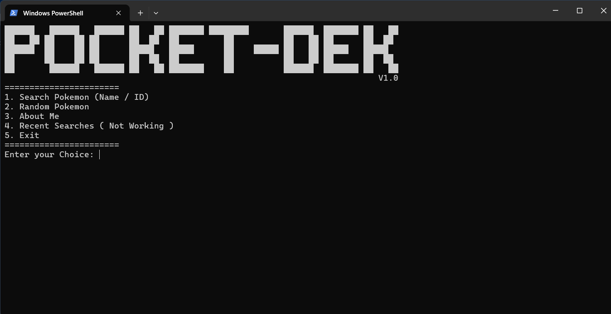

<p align="center">
    
</p>

# Pocket-Desk


## About the Project

Pocket-Desk is a command-line Pokédex application built while I was learning Python. As a beginner, I wanted a hands-on project that would help me understand programming concepts while working with real API data.

The project was created both as a learning experience and as a fun way to explore Pokémon data.

## Installation

```bash
Soon
```

Run the application:

```bash
Soon
```

## Features

* Search Pokémon by name
* View Pokédex IDs
* Display Pokémon information
* Fetch live data from the PokéAPI
* Simple and beginner-friendly CLI interface

## Contributing

If you're a Pokémon fan and would like to contribute, feel free to fork the repository, make your changes, and open a pull request.

## ? Questions or Suggestions

If you have any questions, suggestions, or feature requests, please open an issue.

Thanks for checking out Pocket-Desk!

— Tushar
